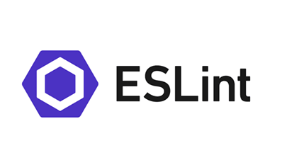

The following is what I’ve gained insight to after the completion of my Manoa Marketplace application. You can read more about my Craigslist-like application here. Although these concepts were exercised in my quest to develop a web application, they are beautifully applicable in all types of software development, from building a compiler, all the way to programming microcontrollers like the Raspberry Pi.

## User Interface Frameworks
A classic example of efficiency is when using existing a framework. Why reinvent the wheel when there are excellent examples readily available for modification and deployment? Utilizing a framework allows developers to view the project in a manner that focuses on the bigger picture. You can read more about frameworks in an essay I wrote here.

## Issue driven project management (IDPM)
Getting several developers to work together effectively can be a project on its own sometimes. An issue is assigned to just one person; that person is solely responsible for solving the issue. I really enjoyed this allocation of responsibility because it makes clear who is working on what, and who to consult when there are further problems with that particular issue.

## Testing
I think it would be foolish to consider a project complete without adequate testing. If building a web app for the public, it’s of vital importance to understand what the public really thinks about your application. Attributes for evaluation include functionality, ease of use and much more. Having real user-feedback allows the project to be augmented in a way that is meaningful. Additionally, thorough testing is necessary to be aware of those pesky bugs. Finding that a bug exists is often more challenging than fixing it, so it is critical that testing is conducted.

## Conclusion
These concepts don’t just exist in a vacuum; they exist alongside several other ideas beyond the use case of web applications. I’m truly excited by the versatility of the above tools. I can’t wait to use what I’ve learned again in my future software development projects.

