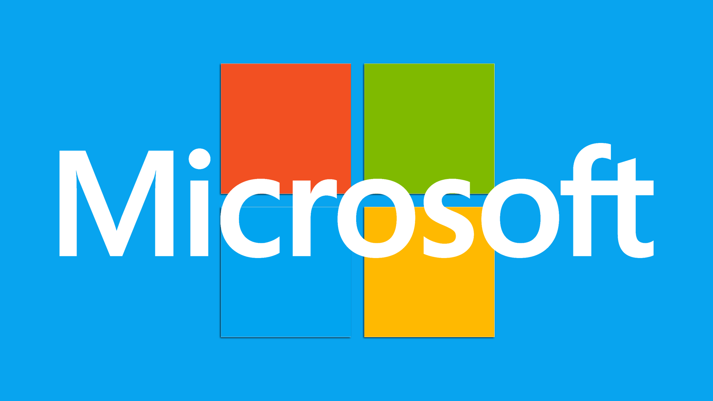
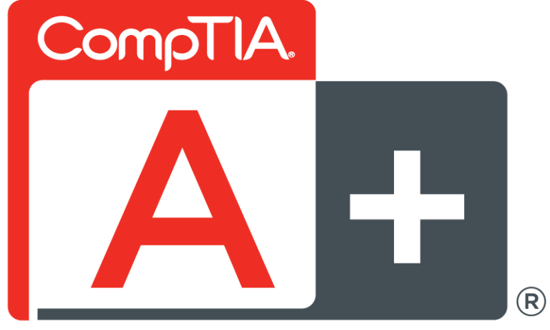

The company I interned for is comprised of 50+ users on a Windows domain. At this job, I was tasked with the following:
<ul>
  <li> Configuration and provisioning of laptops </li>
  <li> Troubleshooting any issues that arose </li>
  <li> Automation through the use of scripting </li>
  <li> Upgrade server equipment </li>
</ul>

I learned about many aspects of systems administration. Initially, I was overwhelmed with how many systems and tools are required to work in information technology. I realized that many of these systems can be broken down into smaller sub-systems so as to make it easier to understand and troubleshoot. This concept of modularization came to me with great familiarity because of my experience in programming. 
I spent much time learning about the business and enterprise products of Microsoft. Products such as Exchange mail, Windows server and Azure were a part of the required arsenal. 

## A+ Certified

After just a few months at this internship, I learned to implement much of the knowledge that I had attained through studying for the CompTIA A+ certification. I went and took the exam, and that day I earned the A+ certified credential.
In the near future, I plan to earn more IT certifications - particularly those about networking and security.

