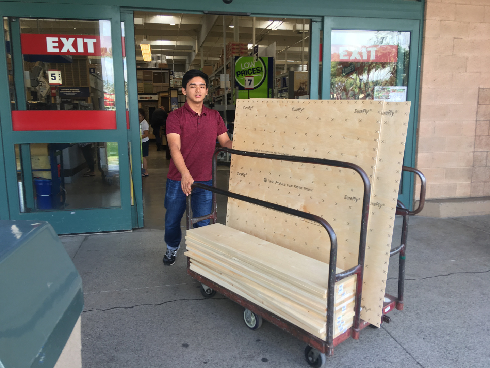
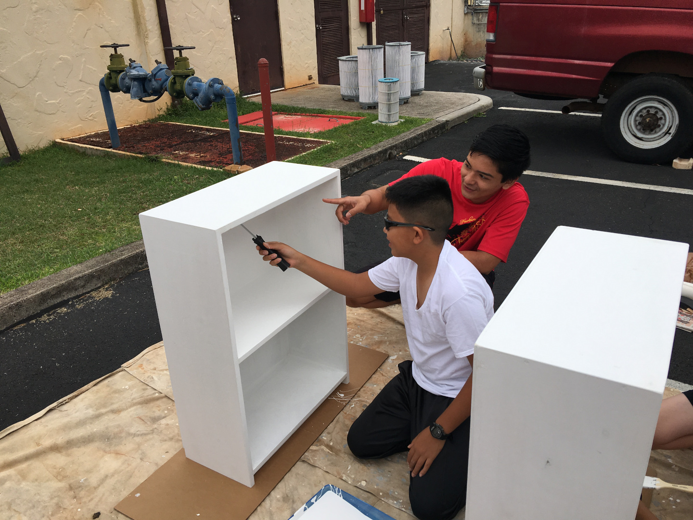
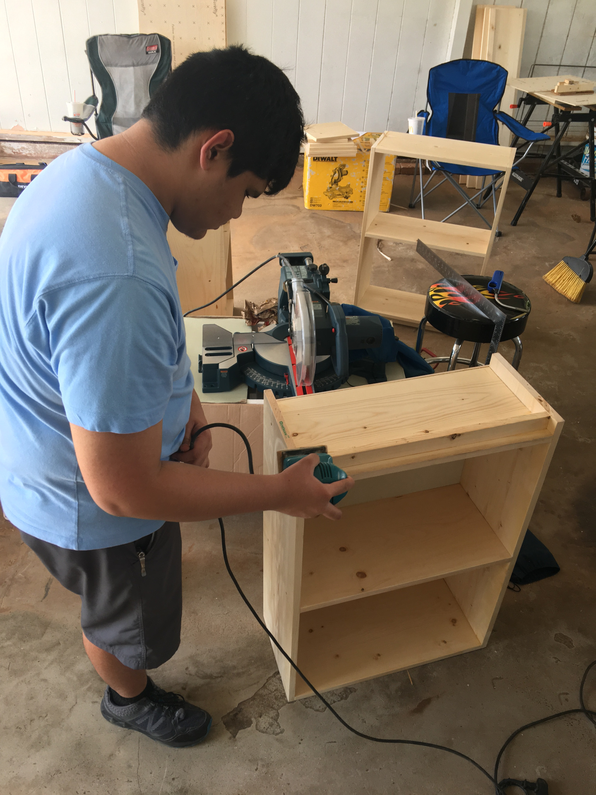

  
  
  

Kumuhonua is a transitional living center located at Kalaeloa, Barbers Point for those who are homeless or at-risk for homelessness. I will lead a team in the assembly and completion of shelf units for the shelter to implement in their housing units.

Within the housing units, storage and organizational methods are limited. The addition of shelves will enhance and provide capability in organizing the belongings of tenants.
To keep the costs of the materials down, various hardware stores were surveyed for their lumber offerings and prices as the lumber would make up the bulk of the budget.
I used a tape measure to visualize and finalize the dimensions of the shelf design.

## What went well?
Volunteers under my leadership who were helping with the construction process were able to follow my instructions and guidance.
The plans that I had for the shelf came together exactly how I had wanted it to. The shelves were of appropriate size and proportions.
A variety of tools including those for cutting, bracing and holding were available to me; This made the construction process more streamlined for my volunteers to do.

## Challenges
Some scouts had no experience in carpentry or painting whatsoever. When painting, providing instruction to a group of beginners on the technique of painting was challenging. Many of the skills needed for this project are related to carpentry and painting. Providing instruction to get their building and painting skills up to par.

Quality control was another area of complexity for me. I had to teach the scouts what kind work was acceptable and how to correct imperfections.

## Conclusion

I learned that people have different learning styles. Some were most effective when guided in a verbal manner. Others were better when they were lead with example and demonstration. It is the responsibility of the leader to ensure that the information being conveyed is bein
