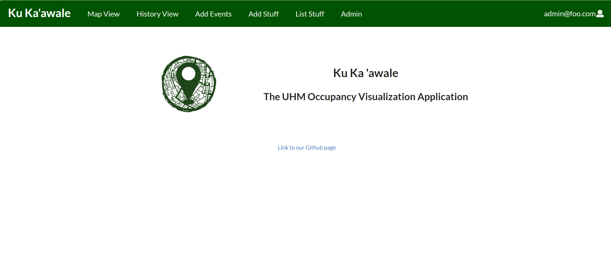
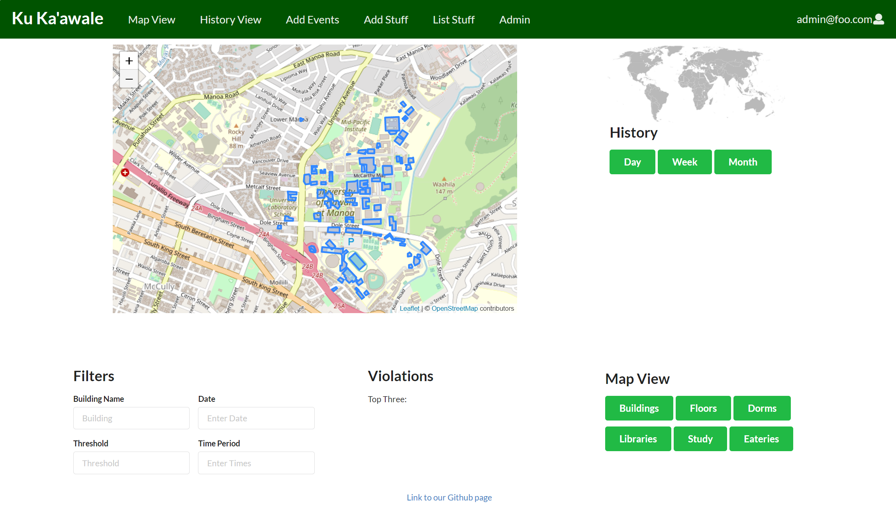
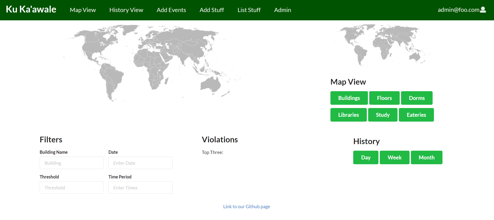

## What the hecc is the HACC?
[Hawaii Annual Code Challenge](https://hacc.hawaii.gov/)
#### Think hackathon, but longer
While most hackathons usually give participants just a day or just a weekend, the HACC provides participants several weeks to dream up a solution, come up with a plan, learn, and develop to bring their ideas to a proof of concept reality.
#### Built for and built by the Aloha State
Another facet of the the HACC that makes it unique amoungst other hackathons is its location and its intent. The HACC offers challenges that are reverse-pitched by various departments of the state, and also various institutions in the state of Hawaii.

This is my second time participating in the HACC. My team included the following developers:
- [Pauline](https://github.com/Pauline-Peihan-Wu)
- [Patima](https://github.com/patimapoochai)
- [Victor](https://github.com/vjodar)
- [Sophia](https://github.com/sophiaelizecruz)

## UH Manoa campus is in use, even during the pandemic
The challenge we chose to address was for the UH Manoa Campus. Being open during the pandemic, it's important that we monitor and plan around social distancing. 
The data comes from the hundreds of wireless access points (AP) throughout the Manoa campus. We can assume that nearly every person on campus has a wireless device that is connected to the campus wifi. As the people roam about the campus, their wireless device will connect to the strongest broadcast (usually the closest access point). 

## Our Solution
Ku Ka'awale (to stand apart) is a web application designed to visualize campus occupancy. In light of the COVID-19 pandemic, as well as for the eventual transition back into in-person learning, the application is designed to identify patterns of use in buildings across campus through the sampling of the WiFi management and obtaining anonymized data. This project hopes to recognize patterns of campus activities scheduled and unscheduled, to improve future scheduling, reduce the spread of COVID-19 on campus, and increase the efficiency of campus scheduling procedures and operations.

This is the landing page of our web application.

The main attraction of our web app can be seen here. A dashboard consisting of the campus map, and stats surrounding.

A historical view is also made available through our application.

The application displays a map of the UHM campus with different viewing perspectives and would allow users to look up the capacities of buildings across campus during certain time frames. Similarly, the application should display warnings such as the most crowded buildings, and allows users to book events through the site, and see if the space that they hope to book is within the campus safety regulations. While the user is booking an event, they are also made aware of events that may be occurring at the time frame they want. 

### [Devpost](https://devpost.com/software/ku-ka-awale#updates)
### [GitHub](https://github.com/HACC2020/StayAtHomeCoder)
## Expectation: Our game plan
To date, my favorite course I've taken in my college career was ICS 314 - Software Engineering I. In this course, I made it through an entire tech stack, learning many tools to help me during each stage of development. Many of my team mates have also already taken ICS314 and were thus already familiar with the tech stack, techniques, and processess taught in that course. 

We divided our time by weeks, where each week was labaled as a sprint/milestone. Just like we learned in our Software Engineering course, we used issue-driven project management to keep our progress efficient and timely.

The challenge specifications fit the description of a dashboard. Instead of trying to reinvent the wheel, our team decided on looking for a dashboard framework. As a longtime lurker of the r/homelab subreddit,, I often see other homelab enthusiests using Grafana to power their homelab analytics dashboard. I pitched this idea to my team as a potential framwork. Much of week one and two were spend learning about Grafana and determining if it had the right features and modules for our HACC challenge. While much of the analytics and interface were already squared away, we knew that we would still have to solve the big problem of generating a heat map over our geographic map.

### What I worked on
From the day the team was formed, I worked extensively on brainstorming, planning, and defining project requirements.

For our initial idea of using Grafana, I stood up an instance of Grafana using Amazon Web Services Light Sail. This part came easy because of my work experience in IT.

I helped to put together our deliverables for our project. I created the features demo video.

## Reality: What really happened
With only a week remaining, we decided to go back to basics - back to using the template we used in ICS314. It was familiar to each of us, and we already knew what it could do. It was just a matter of implementing what we had already worked out into that template.
Although this was the most sensible action for us to take, it felt devestating knowing that the dozens of hours learning about Grafana wouldn't be able to be used.

#### We were missing a lot of information
While the data given to us only included only the name of the access point and its corresponding building, and the max and unique number of clients, we were still missing the actual geographic location of each access point. We were expecting to have the coordinates of each AP in the latitude and longitude format. Without this coordinate information, we were left guessing where each AP actually was. Some of the buildins are multi-story and very large in area - so deteriming where the AP actually was turned out to be an impossible task.
To work around this issue, we decided to work on a small subset of the data that we were given. Not only did this solve our lack of given information, but it also helped us with our lack of remaining time.

## The dust has settled... Now what?
While initially it felt like we had failed, I realized that I had to learn a lot throughout those three weeks. I really enjoy reflecting upon this experience, as it brings a broad spectrum of emotions back to mind. From the excitement of starting a big project, to the fear of the unknown, to the stress of the clock ticking, and to the joys of learning new things, this was overall an excellent experience. I cannot put a price on how valuable this experience was for me and the whole team.

### Further Development for Ku Ka'awale
- Implement true heat map
- Mobile application available to campus-goers

In the future, I would like to come into a hackathon with a team already in mind. It's challenging to have to learn about how your team works most effectively while burning timing that could be used for developing the actual project.

HACC 2020 has been my second hackathon I've ever participated in. I'm encouraged to take on my third hackathon. Considering that we are all living during the pandemic, I'm more open to trying national hackathons that are not local to the state of Hawaii. 
